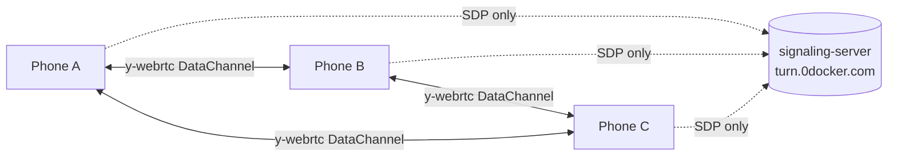

# mesh-firefly-walk

[](https://baditaflorin.github.io/mesh-firefly-walk/)
[](https://github.com/baditaflorin/mesh-firefly-walk/blob/main/package.json)
[](LICENSE)
[](docs/adr/0001-deployment-mode.md)

> Peer-to-peer browser mesh. Phones pulse soft yellow in clock-synced unison. From a distance, a walking group looks like a swarm of fireflies.

**Live:** https://baditaflorin.github.io/mesh-firefly-walk/

Open the link on every phone in your group. Tap **Begin pulsing**. That's it — no accounts, no installs, no server you have to trust.

## How it works

1. Each phone joins a shared **Yjs document** over **y-webrtc** via my [self-hosted signaling server](https://github.com/baditaflorin/signaling-server).
2. Every 1.5 s, each peer publishes its `Date.now()` into Yjs **awareness**.
3. Every peer computes the **median offset** to all other live peers and treats that as "mesh time."
4. The pulse envelope is a pure function of `mesh-time mod period`, so every phone draws the same brightness at the same instant.

Synchrony settles to roughly **10–30 ms** across the mesh once two ping rounds have arrived. That's well under the perceptual threshold for "all pulsing together."

## What's on the wire

Peer-to-peer, only `{ t: 1715... }` timestamps and Yjs CRDT deltas. No location, no audio, no peer-to-peer identity. If you can't see the other phones, your phones aren't talking.

Separately, the shared app shell fires a one-time, opt-out-able pageview beacon (room ID + a peer-id fragment) to an analytics pixel on app load — see [docs/privacy.md](docs/privacy.md#what-the-analytics-beacon-can-see) for exactly what it sends and how to disable it.

## Privacy threat model

See [docs/privacy.md](docs/privacy.md). The short version: any peer in the same room can see your phone's wall-clock time; the signaling server and TURN relay carry only encrypted WebRTC traffic and cannot read your timestamps; and a separate analytics beacon (opt-out-able) sees your room ID on join. Full breakdown in the linked doc.

## Architecture

- **Mode A** — pure GitHub Pages, zero backend at runtime. ([ADR 0001](docs/adr/0001-deployment-mode.md))
- **WebRTC transport** — Yjs + y-webrtc, with a self-hosted signaling server and TURN relay you can swap from the Settings drawer.
- **No GitHub Actions** — the `docs/` directory is the built site, committed directly. Pre-push hooks gate formatting, typecheck, and a build smoke test.



## Run it locally

```bash
git clone https://github.com/baditaflorin/mesh-firefly-walk.git
cd mesh-firefly-walk
npm install
npm run dev
```

Open the URL printed by Vite on two devices on the same Wi-Fi (or different networks — TURN relay will kick in).

## Build for Pages

```bash
npm run build       # writes to docs/
npm run pages-preview  # serves docs/ at http://localhost:4174 exactly as Pages will
```

The `docs/` output is committed to the repo. GitHub Pages is configured to serve from `main` branch, `/docs` folder.

## Self-hosted infrastructure

| Repo                                                                   | Endpoint                               | Role                        |
| ---------------------------------------------------------------------- | -------------------------------------- | --------------------------- |
| [signaling-server](https://github.com/baditaflorin/signaling-server)   | `wss://turn.0docker.com/ws`            | y-webrtc protocol fan-out   |
| [turn-token-server](https://github.com/baditaflorin/turn-token-server) | `https://turn.0docker.com/credentials` | HMAC TURN creds, 1-hour TTL |
| [coturn-hetzner](https://github.com/baditaflorin/coturn-hetzner)       | `turn:turn.0docker.com:3479`           | TURN relay                  |

All three are mine. Override them from the in-app Settings drawer if you want to use your own. STUN-only fallback kicks in automatically if the TURN endpoint is unreachable.

## Settings (in-app)

- **Room ID** — phones must share one to see each other.
- **Pulse period** — 500–10000 ms. Default 2000 ms.
- **Hue** — 0–359°. Default 48 (warm yellow, the firefly hue).
- **Chirp** — adds a gentle 880→440 Hz tone per pulse.
- **Signaling URL** / **TURN credentials URL** — override the defaults.

All persisted to `localStorage`.

## ADRs

- [0001 — Deployment mode (Mode A, pure Pages)](docs/adr/0001-deployment-mode.md)
- [0002 — Mesh clock-sync algorithm](docs/adr/0002-clock-sync.md)
- [0003 — Pulse-envelope shape and timing](docs/adr/0003-pulse-mechanic.md)
- [0010 — GitHub Pages publishing strategy](docs/adr/0010-pages-publishing.md)

## Local hooks (no GitHub Actions)

```bash
git config core.hooksPath .githooks
```

- **pre-commit** — `prettier --check` + `tsc --noEmit`
- **commit-msg** — Conventional Commits validator
- **pre-push** — runs `scripts/smoke.sh` (build + sanity-check `docs/`)

This account has GitHub Actions billing disabled; all gating happens locally.

## License

[MIT](LICENSE) © 2026 Florin Badita
